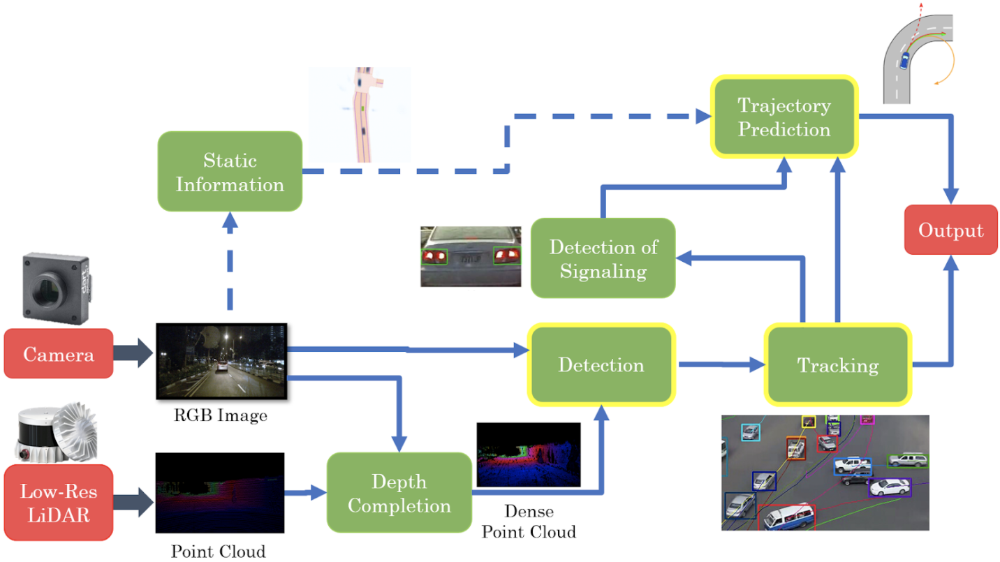

# Portfolio
---
## Work Experience

### Machine Learning Engineer (Part-time remote) - <a href='https://www.promiseq.com/'>promiseQ</a>

promiseQ uses advanced real-time video analysis, object detection and tracking to reduce the cost and time wasted associated to false alarms.

**My contributions** 
* Planning next training iterations
* Integrating the system with <a href='https://neptune.ai/' > Neptune.ai </a>
* Improving object tracking module
* Filtering false positives using rule based techniques
* Image augmentation to reduce class imbalance 

---

## [Self-Driving-Car-Stage-II] Multi-Sensor based Dynamic Object Detection, Tracking, and Trajectory Prediction

The final year project of the degree program and our project is based on dynamic object detection, tracking, trajectory prediction, signal light identification and data collection using LiDAR and camera. 
- Detection and tracking - <a href='https://arxiv.org/abs/2006.11275'> Centerpoint </a> 
  - detection MAP **80.2%**
  - detection FPS **16**
  - tracking  AMOTA **0.65**

- Signal light identification - Simple CNN-LSTM model
- Trajectory prediction - based on <a href='https://drive.google.com/file/d/1Ksq7X5dzouMV2jG1QYcgWzpUl2dKWUDW/view'> ReCoAt (CVPR2021 Workshop on Autonomous Driving) </a>

### 3D object Detection and Tracking

### Trajectory Prediction

Paper submitted to <a href='https://www.ieee-itsc2022.org/'> IEEE-ITSC </a> - **Class-Aware Attention for Multimodal Trajectory Prediction**

<!--  -->

**Abstract**

 Abstract—Predicting the possible future trajectories of the surrounding dynamic agents is an essential requirement in autonomous driving. These trajectories mainly depend on the surrounding static environment, as well as the past movements of those dynamic agents. Furthermore, the multimodal nature of agent intentions makes the trajectory prediction problem more challenging. All of the existing models consider the target agent as well as the surrounding agents similarly, without considering the variation of physical properties. In this paper, we present a novel deep-learning based framework for multimodal trajectory prediction in autonomous driving, which considers the physical properties of the target and surrounding vehicles such as the object class and their physical dimensions through a weighted attention module, that improves the accuracy of the predictions. Our model has achieved the highest results in the nuScenes trajectory prediction benchmark, out of the models which use rasterized maps to input environment information. Furthermore, our model is able to run in real-time, achieving a high inference rate of over 300 FPS. 

 

**Sample Results**

**Quantitative results for nuScenes dataset**

$MinADE_5$ - 1.67m
$MinFDE_1$ - 8.43m

---

## Computer Vision

### CS231n: Convolutional Neural Networks for Visual Recognition

My complete implementation of assignments and projects in [***CS231n: Convolutional Neural Networks for Visual Recognition***](http://cs231n.stanford.edu/2021/) by Stanford (Spring, 2021).

**Implementing CNN image classification module using Numpy:** 
An image classification model implementing with fully connected networks, non linear activations, batch normalization, dropout and convolutional networks including back propagation ([GitHub](https://github.com/)).

**Image Captioning:** An image captioning model with vanilla RNNs, LSTM and Transformer network. RNN and LSTM were implemented from scratch using  numpy including backpropagation. Attention, Multi-head attention and Transformer were implemented using Pytorch ([GitHub](https://github.com/chriskhanhtran/CS224n-NLP-Assignments/tree/master/assignments/a3)).

**GAN:** Implementing Vanilla GAN, Least Square GAN and Deep Convolutional GAN (DCGAN). 

**Network Visualization:** Visualizing a pretrained model using saliency maps, fooling images and class visualization.

---
## Natural Language Processing

### CS224n: Natural Language Processing with Deep Learning

My complete implementation of assignments and projects in [***CS224n: Natural Language Processing with Deep Learning***](http://web.stanford.edu/class/cs224n/) by Stanford (Winter, 2019).

**Neural Machine Translation:** An NMT system which translates texts from Spanish to English using a Bidirectional LSTM encoder for the source sentence and a Unidirectional LSTM Decoder with multiplicative attention for the target sentence ([GitHub](https://github.com/)).

**Dependency Parsing:** A Neural Transition-Based Dependency Parsing system with one-layer MLP ([GitHub](https://github.com)).

---

## Internship Projects

Company: [Creative Software](https://www.creativesoftware.com/)
### Corrosion Detection using Semantic Segmentation

Corrosion Detection for industrial environment using semantic segmentation. I used U-Net model for semantic segmentation. I completed writing the model, testing and all the training. Using a combination of focal loss and dice loss increased the accuracy significantly and using lot of augmentations reduced false positives.

Synthetic data generation is also done using Unity 3D since the real image dataset was not enough.

### Object Detection in Industrial Environment

Object detection model was trained using Detectron2 for idenitifying industrial objects like gauges, motors, valves, pumps etc. 

---

### Garment ReConstruction - NeurIPS Challenge

3D Texture garment reconstruction using CLOTH3D dataset and SMPL body parameters. PyMesh, Open3d, Meshlab, MeshlabXML, Pytorch Geometric libraires were used.

Only the data preprocessing part is done. The model is yet to be implemented.

**Subsampling points**

**Non-rigid Iterative Closest Point (ICP)**

**Custom maxpooling**

### Deep Surveilance System (DSS) - SLIOT Challenges

 Deep Surveillance System, an IoT device which is triggered by threatening sounds to activate the camera. The product included hardware, sensors, ML model, web based UI as well. Urban 8K sound dataset and TensorFlow were used for model training. Implemented using Raspberry Pi, OpenCV and Azure. I involved in model wrting, training and hardware implementation.

DSS won 2nd place in the open category of Sri Lanka IoT competition (SLIOT). 

---
### Detect Spam Messages: TF-IDF and Naive Bayes Classifier

In order to predict whether a message is spam, first I vectorized text messages into a format that machine learning algorithms can understand using Bag-of-Word and TF-IDF. Then I trained a machine learning model to learn to discriminate between normal and spam messages. Finally, with the trained model, I classified unlabel messages into normal or spam.

 

 

---
## Data Science

### Credit Risk Prediction Web App

After my team preprocessed a dataset of 10K credit applications and built machine learning models to predict credit default risk, I built an interactive user interface with Streamlit and hosted the web app on Heroku server.

 

 

---
### Kaggle Competition: Predict Ames House Price using Lasso, Ridge, XGBoost and LightGBM

I performed comprehensive EDA to understand important variables, handled missing values, outliers, performed feature engineering, and ensembled machine learning models to predict house prices. My best model had Mean Absolute Error (MAE) of 12293.919, ranking <b>95/15502</b>, approximately <b>top 0.6%</b> in the Kaggle leaderboard.

 

 

---
### Predict Breast Cancer with RF, PCA and SVM using Python

In this project I am going to perform comprehensive EDA on the breast cancer dataset, then transform the data using Principal Components Analysis (PCA) and use Support Vector Machine (SVM) model to predict whether a patient has breast cancer.

 

 

---
### Business Analytics Conference 2018: How is NYC's Government Using Money?

In three-month research and a two-day hackathon, I led a team of four students to discover insights from 6 million records of NYC and Boston government spending data sets and won runner-up prize for the best research poster out of 18 participating colleges.

 

 

---
## Filmed by me

Besides Data Science, I also have a great passion for photography and videography. Below is a list of films I documented to retain beautiful memories of places I traveled to and amazing people I met on the way.

 

- [Ada Von Weiss - You Regret (Winter at Niagara)](https://www.youtube.com/watch?v=-5esqvmPnHI)
- [The Weight We Carry is Love - TORONTO](https://www.youtube.com/watch?v=vfZwdEWgUPE)
- [In America - Boston 2017](https://www.youtube.com/watch?v=YdXufiebgyc)
- [In America - We Call This Place Our Home (Massachusetts)](https://www.youtube.com/watch?v=jzfcM_iO0FU)

---

© 2020 Khanh Tran. Powered by Jekyll and the Minimal Theme.
