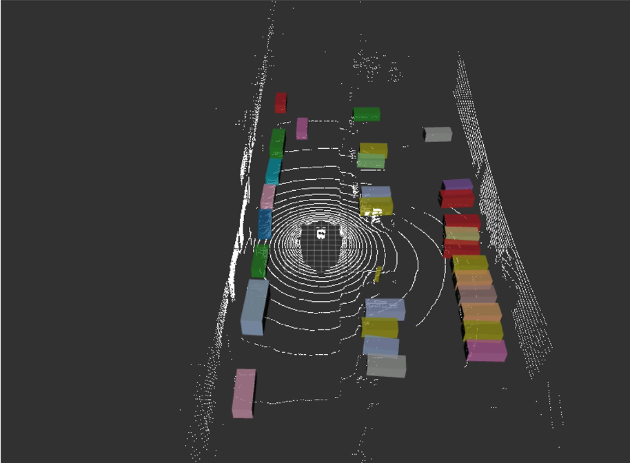
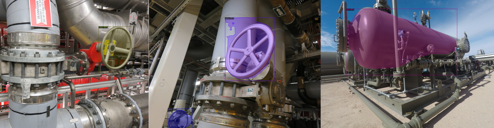

# Portfolio
---

## PhD student - Arizona State University

**Image editing for referring expressions - ongoing**

**Dual Caption Preference Optimization for Diffusion Models - under review**
Authors - Amir Saeidi, Yiran Lawrence Luo, Agneet Chatterjee, Shamanthak Hegde, Bimsara Pathiraja, Yezhou Yang, Chitta Baral.

**Investigating the Shortcomings of LLMs in Step-by-Step Legal Reasoning**
Authors - Venkatesh Mishra\*, Bimsara Pathiraja\*, Mihir Parmar, Sat Chidananda, Jayanth Srinivasa, Gaowen Liu, Ali Payani, Chitta Baral.
**Accepted at NAACL 2025 Findings** 🎉🎉

**ExpressivityArena: Can LLMs Express Information Implicitly?**
Authors - Joshua Tint, Som Sagar, Aditya Taparia, Caleb Liu, Kelly Raines, Bimsara Pathiraja, Ransalu Senanayake.
**Accepted at NeurIPS 2024 Workshop on Behavioral Machine Learning!** 🎉🎉

**Fairness in Autonomous Driving: Towards Understanding Confounding Factors in Object Detection in Challenging Weather**
Authors - Bimsara Pathiraja, Caleb Liu, Ransalu Senanayake.
**Paper Accepted at CVPR 2024 Workshop on Data-Driven Autonomous Driving Simulation!** 🎉🎉

## Research Assistant - Mohamed bin Zayed University of Artificial Intelligence - UAE

**Topic - Network Calibration on Object Detection**
Authors - Bimsara Pathiraja, Malitha Gunawardhana, Muhammad Haris Khan
## 🎉 Exciting News! 🎉

**Paper Accepted at CVPR 2023!**

We are thrilled to announce that our paper has been accepted at CVPR 2023! This is a significant milestone for our research team, and we are incredibly proud of this achievement.

**Title:** Multiclass Confidence and Localization Calibration for Object Detection

**Abstract**

 Albeit achieving high predictive accuracy across many challenging computer vision problems, recent studies suggest that deep neural networks (DNNs) tend to make overconfident predictions, rendering them poorly calibrated. Most of the existing attempts for improving DNN calibration are limited to classification tasks and restricted to calibrating in-domain predictions. Surprisingly, very little to no attempts have been made in studying the calibration of object detection methods, which occupy a pivotal space in vision-based security-sensitive, and safety-critical applications. In this paper, we propose a new train-time technique for calibrating modern object detection methods. It is capable of jointly calibrating multiclass confidence and box localization by leveraging their predictive uncertainties. We perform extensive experiments on several in-domain and out-of-domain detection benchmarks. Results demonstrate that our proposed train-time calibration method consistently outperforms several baselines in reducing calibration error for both in-domain and out-of-domain predictions. Our code and models are available at https://github.com/bimsarapathiraja/MCCL. 

 

## Machine Learning Engineer (Part-time remote) - <a href='https://www.promiseq.com/'>promiseQ</a>

promiseQ uses advanced real-time video analysis, object detection and tracking to reduce the cost and time wasted associated to false alarms.

**My contributions** 
- **Planning next training iterations** - Worked on reducing class imbalance, cleaning the data, visualizing the dataloader, changing augmentations to improve the object detection accuracy.
- **Integrating the system with <a href='https://neptune.ai/' > Neptune.ai </a>** - Neptune.ai provides the facility to track our experiments and log all the results needed. I integrated the whole model, training procedure into Neptune.ai, so that the hyperparameters, configurations and results would not lost.
- **Improving object tracking module** - Completed a study on mulit-object real-time tracking method and working on improving the tracking accuracy.
- **Filtering false positives using rule based techniques** - To minimize the false positives of the product, I am working on a rule based method which will be implemented on top of the object detection module.  
- **Reducing class imbalance** - I am using image augmentation and synthetic data generation to reduce the class imbalance.

---

##  [Self-Driving-Car-Stage-II] Multi-Sensor based Dynamic Object Detection, Tracking, and Trajectory Prediction

The final year project of the degree program and our project is based on dynamic object detection, tracking, trajectory prediction, signal light identification and data collection using LiDAR and camera. 

Worked on trajectory prediction and signal light identification for autonomous driving. We proposed Class-aware attention for trajectory prediction where the future trajectory of the target agent depends on the vehicle classes of both target and surrounding agents. The model ranked 12th position in the nuScenes trajectory prediction leaderboard and 1st place which uses rasterized maps for the implementation. Introduced a camera and LiDAR sensor fusion method that can be used for low-resolution LiDAR while still maintaining accuracy.

- Detection and tracking - <a href='https://arxiv.org/abs/2006.11275'> Centerpoint </a> 
  - detection MAP **62.8** (In the sensor fusion method: MVP + Centerpoint)
  - detection FPS **20** (In the fastest method: Centerpoint: Pointpillars )
  - tracking  AMOTA **63.8**

- Signal light identification - Simple CNN-LSTM model
- Trajectory prediction - based on <a href='https://drive.google.com/file/d/1Ksq7X5dzouMV2jG1QYcgWzpUl2dKWUDW/view'> ReCoAt (CVPR2021 Workshop on Autonomous Driving) </a>

### 3D object Detection and Tracking

 

### Trajectory Prediction

Paper submitted to <a href='https://www.ieee-itsc2022.org/'> IEEE-ITSC </a> - **Class-Aware Attention for Multimodal Trajectory Prediction**

<!--  -->

**Abstract**

 Abstract—Predicting the possible future trajectories of the surrounding dynamic agents is an essential requirement in autonomous driving. These trajectories mainly depend on the surrounding static environment, as well as the past movements of those dynamic agents. Furthermore, the multimodal nature of agent intentions makes the trajectory prediction problem more challenging. All of the existing models consider the target agent as well as the surrounding agents similarly, without considering the variation of physical properties. In this paper, we present a novel deep-learning based framework for multimodal trajectory prediction in autonomous driving, which considers the physical properties of the target and surrounding vehicles such as the object class and their physical dimensions through a weighted attention module, that improves the accuracy of the predictions. Our model has achieved the highest results in the nuScenes trajectory prediction benchmark, out of the models which use rasterized maps to input environment information. Furthermore, our model is able to run in real-time, achieving a high inference rate of over 300 FPS. 

 

**Sample Results**

**Quantitative results for nuScenes dataset**

MinADE_5 - 1.67m
MinFDE_1 - 8.43m

**Leaderbaord:** <a href='https://eval.ai/web/challenges/challenge-page/591/leaderboard/1659'> 12th rank </a> 

---

## Computer Vision

### CS231n: Convolutional Neural Networks for Visual Recognition

My complete implementation of assignments and projects in [***CS231n: Convolutional Neural Networks for Visual Recognition***](http://cs231n.stanford.edu/2021/) by Stanford (Spring, 2021).

**Implementing CNN image classification module using Numpy:** 
An image classification model implementing with fully connected networks, non linear activations, batch normalization, dropout and convolutional networks including back propagation ([GitHub](https://github.com/)).  

**Image Captioning:** An image captioning model with vanilla RNNs, LSTM and Transformer network. RNN and LSTM were implemented from scratch using  numpy including backpropagation. Attention, Multi-head attention and Transformer were implemented using Pytorch ([GitHub](https://github.com/)).

**GAN:** Implementing Vanilla GAN, Least Square GAN and Deep Convolutional GAN (DCGAN). 

**Network Visualization:** Visualizing a pretrained model using saliency maps, fooling images and class visualization.

---
## Natural Language Processing

### CS224n: Natural Language Processing with Deep Learning

My complete implementation of assignments and projects in [***CS224n: Natural Language Processing with Deep Learning***](http://web.stanford.edu/class/cs224n/) by Stanford (Winter, 2019).

**Neural Machine Translation:** An NMT system which translates texts from Spanish to English using a Bidirectional LSTM encoder for the source sentence and a Unidirectional LSTM Decoder with multiplicative attention for the target sentence ([GitHub](https://github.com/)).

**Dependency Parsing:** A Neural Transition-Based Dependency Parsing system with one-layer MLP ([GitHub](https://github.com)). 

---

## Internship Projects

Company: [Creative Software](https://www.creativesoftware.com/)
### Corrosion Detection using Semantic Segmentation

 

Corrosion Detection for industrial environment using semantic segmentation. I used U-Net model for semantic segmentation. I completed writing the model, testing and all the training. Using a combination of focal loss and dice loss increased the accuracy significantly and using lot of augmentations reduced false positives. 

Synthetic data generation is also done using Unity 3D since the real image dataset was not enough.

### Object Detection in Industrial Environment

Object detection model was trained using Detectron2 for idenitifying industrial objects like gauges, motors, valves, pumps etc. 

---

## Other Projects
### Garment ReConstruction - NeurIPS Challenge

 

3D Texture garment reconstruction using CLOTH3D dataset and SMPL body parameters. PyMesh, Open3d, Meshlab, MeshlabXML, Pytorch Geometric libraires were used.

Only the data preprocessing part is done. The model is yet to be implemented. 

**Subsampling points**

**Non-rigid Iterative Closest Point (ICP)**

**Custom maxpooling**

### FPGA processor for Matrix Multiplication

 The project included designing an Instruction Set Architecture (ISA) for FPGA processor for Matrix Multiplication and implementing with all the necessory components using Verilog HDL. A Python simulator was written to test the performance of the processor. We used Intel Quartus Prime, ModelSim and Xillinx to implement and simulate the processor. 

  

### Deep Surveilance System (DSS) - SLIOT Challenges

 Deep Surveillance System, an IoT device which is triggered by threatening sounds to activate the camera. The product included hardware, sensors, ML model, web based UI as well. Urban 8K sound dataset and TensorFlow were used for model training. Implemented using Raspberry Pi, OpenCV and Azure. I involved in model wrting, training and hardware implementation.

DSS won 2nd place in the open category of Sri Lanka IoT competition (SLIOT). 

---

## Interesting Reads

Besides Machine Learning and Computer Vision I have a great passion on reading books. Below is a list of the best picks from my past year reading.

 

- **The Monk Who Sold His Ferrari** - Robin Sharma
- **The Subtle Art of Not Giving a F** - Mark Manson
- **Hyperbole and a Half** - Allie Brosh
- **Sapiens - A Brief History of Humankind** - Yuval Noah Hararri 
  - Best book I have ever read
- **The Hitchhiker's Guide to the Galaxy** - Douglas Adams
- **Becoming** - Michelle Obama
- **Zero to One** - Peter Thiel
- **Permanent Record** - Edward Snowden
- **Crime and Punishment** - Fyodor Dostoevsky
- **The Archer** - Paulo Coelho
- **Art of War** - Sun Tzu
- **A Briefer History of Time** - Stephen Hawking
- **Man's Search for Meaning** - Viktor E. Frankl
- **12 Rules for Life** - Jordan Peterson
- **21 Lessons for the 21st Century** - Yual Noah Hararri

---

© 2020 Khanh Tran. Powered by Jekyll and the Minimal Theme.

